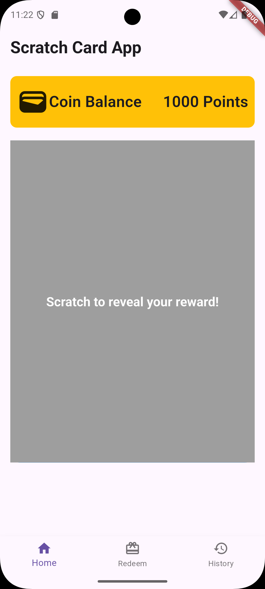
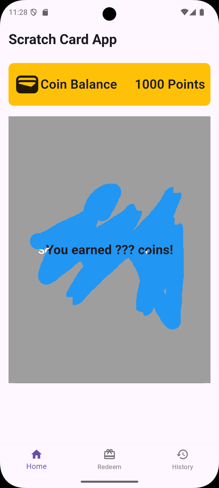
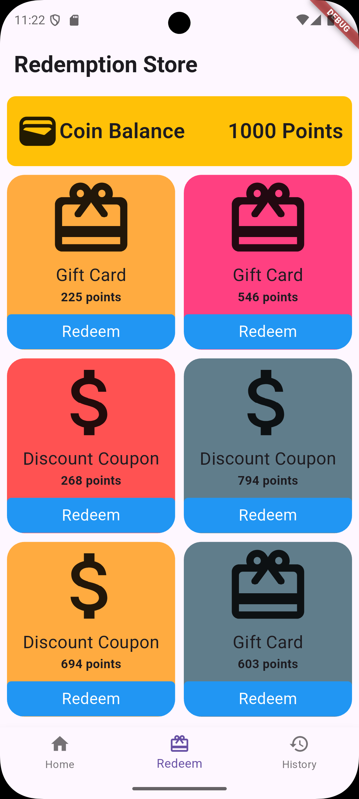
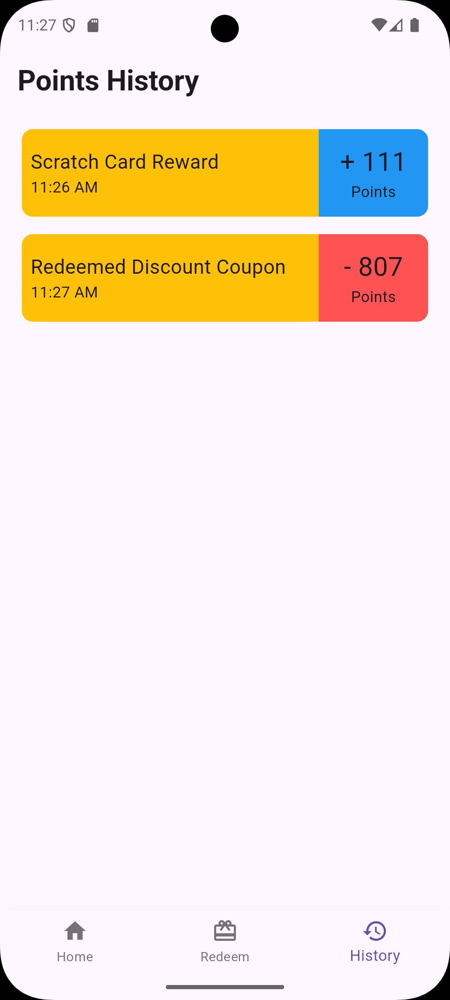

Here’s a `README.md` file for your Scratch Card App project. It provides an overview of the project, setup instructions, and other relevant details.

---

# Scratch Card App

A Flutter-based mobile application where users can scratch a virtual card every hour to earn coins. These coins can be redeemed for gift cards or discount coupons. The app also maintains a history of all transactions.

---

## Features

1. **Scratch Card**:
   - Scratch a card every hour to earn random coins (between 50 and 500).
   - Visual feedback when the card is scratched.
   - Timer to indicate when the next scratch will be available.

2. **Redemption Store**:
   - Browse a list of gift cards and discount coupons.
   - Redeem coins for items if you have enough balance.

3. **Transaction History**:
   - View a history of all transactions (scratch rewards and redemptions).
   - Each transaction includes a description, timestamp, and points.

4. **State Management**:
   - Uses the **BLoC (Business Logic Component)** pattern for managing app state.

---

## Screenshots

| Home Screen | Scratching Screen | Redemption Store | History Screen |
|-------------|------------------|------------------|----------------|
|  | |  |  |

---

## Getting Started

### Prerequisites

- Flutter SDK installed on your machine.
- An IDE (e.g., Android Studio, VS Code) with Flutter and Dart plugins.

### Installation

1. **Clone the repository**:
   ```bash
   git clone https://github.com/your-username/scratch-card-app.git
   cd scratch-card-app
   ```

2. **Install dependencies**:
   ```bash
   flutter pub get
   ```

3. **Run the app**:
   ```bash
   flutter run
   ```

---

## Project Structure

```
lib/
├── bloc/
│   ├── coin_bloc.dart
│   ├── coin_event.dart
│   └── coin_state.dart
├── screens/
│   ├── home_screen.dart
│   ├── redemption_store_screen.dart
│   └── history_screen.dart
├── utils/
│   ├── scratch_card.dart
│   ├── wallet_card.dart
│   ├── redemption_card.dart
│   └── history_tile.dart
├── main.dart
└── README.md
```

---

## BLoC Architecture

The app uses the **BLoC pattern** for state management. Here's how it works:

1. **Events**:
   - `ScratchCard`: Triggered when the user scratches the card.
   - `RedeemItem`: Triggered when the user redeems an item from the store.
   - `ResetScratchAvailability`: Triggered when the scratch card becomes available again.

2. **State**:
   - `CoinState`: Holds the current state of the app, including:
     - Coin balance.
     - Scratch card availability.
     - Redemption items.
     - Transaction history.

3. **BLoC**:
   - `CoinBloc`: Handles business logic and emits new states based on events.

---

## Dependencies

- [flutter_bloc](https://pub.dev/packages/flutter_bloc): For state management.
- [equatable](https://pub.dev/packages/equatable): For comparing objects in BLoC.
- [intl](https://pub.dev/packages/intl): For formatting dates and times.

---

## How to Contribute

1. Fork the repository.
2. Create a new branch for your feature or bugfix.
3. Commit your changes with clear and descriptive messages.
4. Push your branch and submit a pull request.

---

## License

This project is licensed under the MIT License. See the [LICENSE](LICENSE) file for details.

---

## Contact

For questions or feedback, feel free to reach out:

- **Priyanshu Sidar**
- **Email**: sidarsunita2@gmail.com
- **GitHub**: [WannabeKing](github.com/Wannabe-King)

---

Enjoy scratching and redeeming! 🎉
